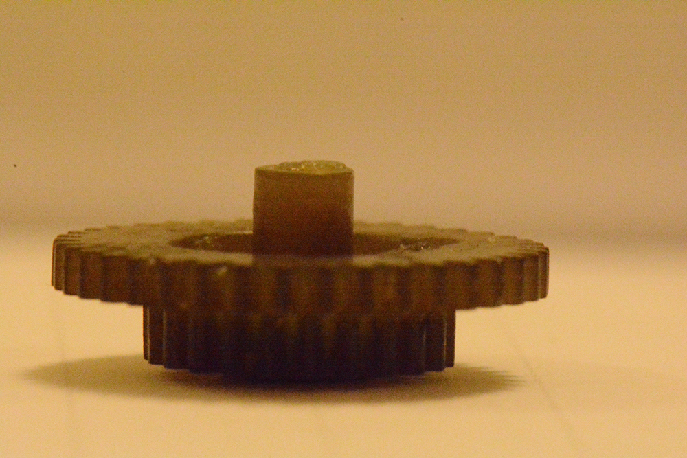
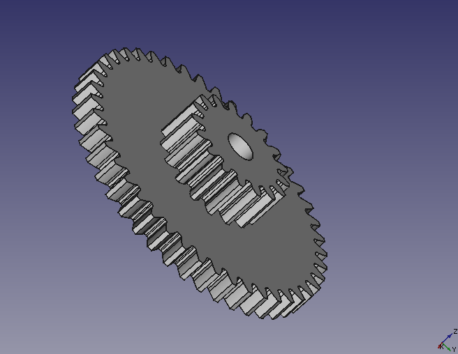
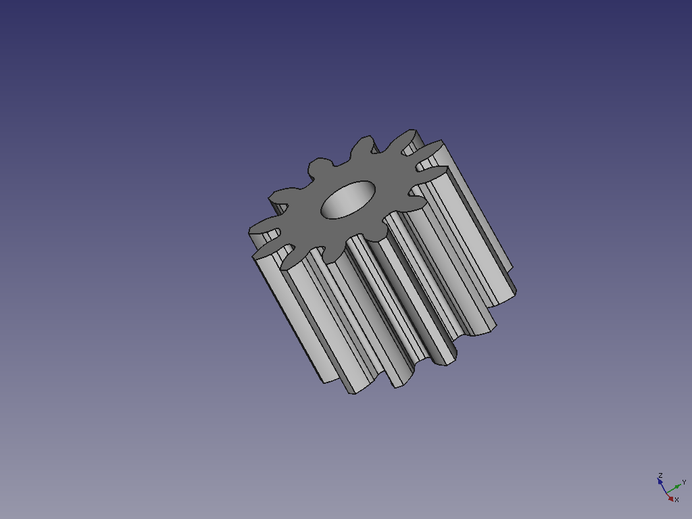

# Motor Meter Gears for BMW e30 - KM version - NO VDO

Here you have the 38*23 Gear, 44x17 Gear and 12Teeth Gears, this can be used for Motor Meter and VDO.

##License

This work is under [Creative Commons Attribution-ShareAlike 4.0 International License](http://creativecommons.org/licenses/by-sa/4.0/). Please read the LICENSE files for more details.
